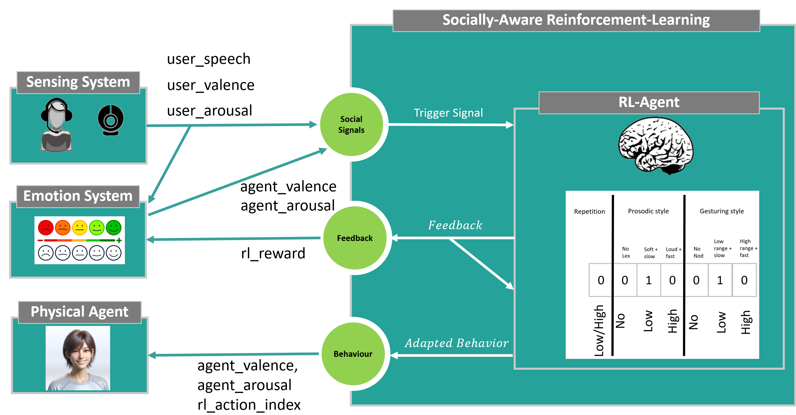
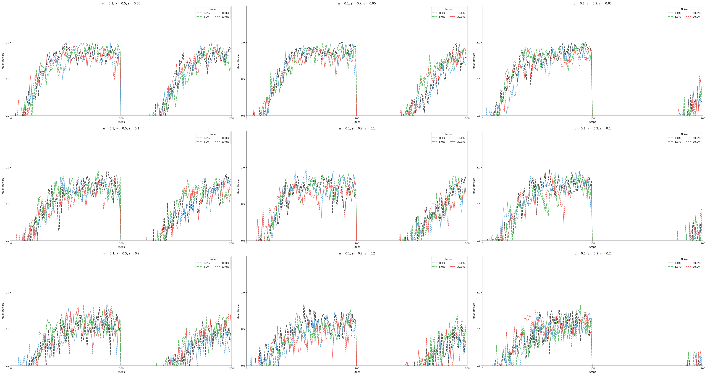

# Distributed Socially-Aware Reinforcement Learning

  

This repository implements Socially-Aware Reinforcement Learning as a loosely coupled network component. It supports both a live and a simulation app.

For both, a use case is implemented where the RL agent implicitly adapts its backchannel behavior to user preferences (see picture for state-based model). The state space models three sections. The first indicates whether the whole backchannel sequence is repeated. The second indicates how expressively the virtual character applies its prosody when using lexical backchannels. The third refers to nodding and determines how expressively the character should use this backchannel type. The difference in user valence from the previous turn is used as a reward signal. The actions are either modelled as the action itself (K-armed bandit) or into the state (state-based algorithms). In the latter case the RL action resembles rather a state-modification (moving the numbers within a certain subsection of the state). The action is physically applied by reading from the state and applying the encoded action.
Examples of backchannel types are (see behavior/bc_feedback.py):
- reactive bc (lexical word): 'okay', 'alright' ,'right', 'I see'
- audio bc: 'mhm', 'ah huh'
- acknowledgement: 'yeah', 'yes'
- repetition + uh huh/ok/i see/yes

## Live App
The live application requires a social signal sensing system streaming its data to the RL agent. Some of these input signals can be configured to trigger the RL learning step, enabling the RL to adapt online. Other input signals will serve as rewards for the system. The selected action of the RL is applied by sending an index to an intermediary app controlling a virtual character. This character is assumed to realize the prosodic and nonverbal behavior according to these actions.

## Simulation App
The simulation supports the same RL model and algorithms as the live app. For each simulation, multiple experiments are started. Each experiment initializes a new user with random preferences and consists of a pre-configured number of steps (e.g., 100), aiming to simulate the same number of interactions with a user.
For every RL step, the reward is shaped according to the distance from the current state to the user preference. The more similar the BC configuration is to the preference, the more reward is provided.

- 0 steps: reward=1.0
- 1 steps: reward=0.5
- 2 steps: reward=0.25

Since human users sometimes change their preferences spontaneously, noise is added to the reward according to the following probabilities: 0%, 5%, 10%, 30%.
Similarly, users can change their preferences in the long run. This can be configured in the simulation by specifying the steps at which the user preference should generally change (default: after half of the maximum steps per experiment). This shows how well the corresponding algorithm recovers from such changes. The following figure depicts a simulation with different RL parameters for Q-learning (learning rate = 0.2):

  

Additional simulation plots for the K-armed bandit, Q-learning, and TDC algorithms can be found in the experiments folder.

## Parameters

The following configurations are set in **`config/settings.py`**. Among others the algorithm can be set there: K-armed bandit, Q-learning, gradient-based TDC.

| **Parameter**              | **Value**                             | **Description**                                                                 |
|----------------------------|---------------------------------------|---------------------------------------------------------------------------------|
| `SAVE_POLICY`               | `True` or `False`                    | Enable or disable saving the learned policy.                                    |
| `LOAD_POLICY`               | `True` or `False`                    | Enable or disable loading a previously saved policy.                            |
| `SAVE_GRAPHS`               | `True` or `False`                    | Enable or disable saving graphs generated during the learning process.          |
| `SHOW_GRAPHS`               | `True` or `False`                    | Enable or disable displaying graphs during runtime.                             |

The following endpoints are required for live mode to work and open a server for receiving corresponding signals.

| **Endpoint**       | **IP Address**       | **Description**                                                                      |
|--------------------|----------------------|--------------------------------------------------------------------------------------|
| `explicit_feedback` | `127.0.0.1:1234`     | Receives explicit signals from other applications (e.g., buttons for good/bad feedback). |
| `valence_agent` | `127.0.0.1:5000`     | Receives agent emotions (Valence) based on Russell's circumplex model.               |
| `arousal_agent` | `127.0.0.1:5001`     | Receives agent emotions (Arousal) based on Russell's circumplex model.              |
| `valence_user` | `127.0.0.1:5002`     | Receives user emotions (Valence) based on Russell's circumplex model.               |
| `arousal_user` | `127.0.0.1:5003`     | Receives user emotions (Arousal) based on Russell's circumplex model.               |
| `user_turn_wav`    | `127.0.0.1:5004`     | Receives a user's voice (wav file) from a voice recognition pipeline.               |

The following endpoints open a client to send values (e.g., for controlling a virtual character).

| **Endpoint**           | **IP Address**       | **Description**                                                              |
|------------------------|----------------------|------------------------------------------------------------------------------|
| `valence_agent_key`     | `127.0.0.1:6000`     | Sends agent emotions (Valence) based on Russell's circumplex model.           |
| `arousal_agent_key`     | `127.0.0.1:6001`     | Sends agent emotions (Arousal) based on Russell's circumplex model.           |
| `rl_action_key`         | `127.0.0.1:6004`     | Sends the index for the action selected by the RL agent.                      |
| `pos_r_key`             | `127.0.0.1:6005`     | Sends positive rewards.                                                       |
| `neg_r_key`             | `127.0.0.1:6006`     | Sends negative rewards.                                                       |

## Requirements
- install python 11
- install requirements.txt
- for live app:
  - social sensing system
  - virtual character

## Run Apps
- run main.py for both the simulation and the live app
- multiple_simulations_main.py showcases how to run multiple simulations at once by providing multiple values for common RL parameters (learning rate, exploration, etc.).
